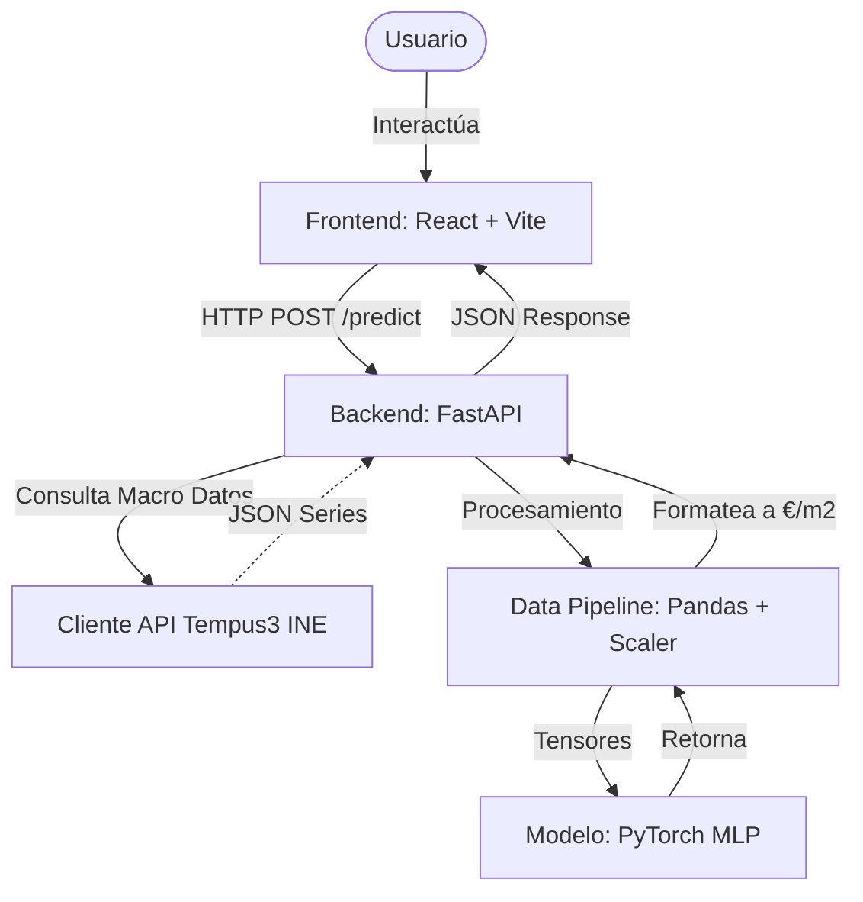

# Arquitectura del Proyecto Casalia

Este documento detalla la arquitectura de software, los patrones de diseño y las tecnologías utilizadas en la plataforma **Casalia**. Casalia es una aplicación *Full-Stack* orientada a predecir el precio futuro de la vivienda utilizando un modelo de Deep Learning entrenado con datos macroeconómicos reales.

---

## 1. Visión General de la Arquitectura

Casalia sigue un enfoque clásico de arquitectura Cliente-Servidor (Frontend-Backend), pero introduce un motor de Machine Learning embebido directamente en el ciclo de vida del backend. 

La plataforma está dividida en dos grandes bloques:
- **Frontend (`web/`)**: Interfaz de usuario interactiva desarrollada en React.
- **Backend y Machine Learning (`ml/`)**: API REST impulsada por FastAPI y un motor de inferencia basado en PyTorch.

### 1.1 Diagrama de Alto Nivel



---

## 2. Componentes del Sistema

### 2.1 Frontend (`/web`)
El frontend está diseñado como una Single Page Application (SPA). Destaca por su rendimiento rápido usando Vite y su estilizado inspirado en la estética Neo-brutalista.

- **Framework Core**: React 18 con TypeScript para un tipado estricto.
- **Build Tool**: Vite, proporcionando un *Hot Module Replacement* (HMR) ultrarrápido y builds optimizados.
- **Estilos e Interfaz**: Tailwind CSS para utilidades atómicas. La UI implementa componentes reutilizables (`/web/src/components/ui`) usando la convención de `lucide-react` para iconografía.
- **Internacionalización**: `react-i18next` para habilitar el uso en múltiples idiomas, permitiendo escalabilidad a mercados extranjeros.
- **Comunicación de Red**: API Fetch nativa de los navegadores que interactúa directamente con los endpoints expuestos del backend.

### 2.2 Backend (`/ml/app`)
El backend actúa como pegamento entre la interfaz de usuario y la lógica matemática. Está estructurado como un microservicio independiente.

- **Framework**: FastAPI (Python), elegido por su alto rendimiento, asincronía y generación automática de documentación (Swagger UI).
- **Validación de Datos**: Pydantic. Los esquemas (`/ml/schemas/`) garantizan que cualquier petición desde el cliente cumpla estrictamente con los tipos de datos requeridos por la IA antes del cómputo.
- **Servidor Web**: Uvicorn. Servidor ASGI ligero y asíncrono.
- **CORS**: Habilitado para permitir solicitudes directas desde el puerto de desarrollo del frontend (`localhost:5173`).

### 2.3 Motor de Machine Learning (`/ml`)

Este bloque es el diferencial analítico del proyecto. Está estructurado en un pipeline unificado de Ingesta, Procesamiento, Entrenamiento e Inferencia.

#### Ingesta de Datos (`ine_client.py`)
- Módulo encargado de comunicarse con la API Tempus3 del **Instituto Nacional de Estadística (INE)**.
- Recolecta tasas como el IPC, Paro, datos demográficos, etc.
- Resiliente ante caídas mediante manejo de parámetros seguros nulos.

#### Pipeline y Feature Engineering (`prepare_data.py`)
- Construido sobre la librería **Pandas**.
- Encargado de limpiar, cruzar (merge) e indexar las variables macroeconómicas con el precio de la vivienda.
- Aplica ventanas deslizantes o "lags" direccionales (`shift(4)` usando periodos trimestrales/anuales) para alinear matemáticamente el precio *actual* con las variables que determinan el precio a *12 meses vista*.

#### Modelo Matemático (`model.py`)
- **Core**: Implementado en **PyTorch**, el estándar industrial actual para Deep Learning.
- **Topología**: Multi-Layer Perceptron (MLP). Una red neuronal densamente conectada feed-forward.
- **Estructura**:
  - Función de activación **ReLU** no lineal tras las capas de contracción de dimensionalidad.
  - La última capa emite un escalar continúo que representa la **variación porcentual interanual**.

#### Flujo de Inferencia (`inference.py`)
1. Carga en memoria la topología (`model.py`) y los pesos entrenados (`models/price_predictor.pt`).
2. Carga en memoria el algoritmo de estandarización (`models/scaler.pt`) entrenado en el conjunto de *Train* original.
3. Toma la petición de validación, escala los datos macroeconómicos ingresados, y computa el paso hacia adelante (`forward pass`) tensorial, desencapsulando finalmente el tensor en un valor monetario legible (en Euros).

---

## 3. Disposición del Árbol de Directorios (Mapeo)

El proyecto cuenta con una separación estricta de *concerns*:

```text
Casalia/
├── ml/                       # MICROSERVICIO DE IA Y BACKEND
│   ├── app/                  # FastAPI Application
│   │   ├── main.py           # Entrypoint (Instancia de app, middlewares CORS)
│   │   ├── routers/          # Controladores HTTP
│   │   └── schemas/          # Modelos de validación Pydantic
│   ├── data/                 # Data Pipeline Almacenamiento
│   │   ├── raw/              # CSV puros 
│   │   └── processed/        # Numpy (.npy) tensores escalados y listos
│   ├── models/               # Pesos guardados del estado de la red e infraestructura
│   │   ├── price_predictor.pt
│   │   └── scaler.pt
│   ├── model.py              # Definición de clases PyTorch
│   ├── train.py              # Bucle de backpropagation / descenso de gradiente
│   ├── inference.py          # Wrapper predictivo (Pasa inputs por la red red entrenada)
│   ├── prepare_data.py       # Preparación tabular usando Pandas
│   ├── ine_client.py         # Interfaz externa con datos del gobierno (INE)
│   └── evaluate_test.py      # Verificación estadística sobre test no vistos
│
└── web/                      # APLICACIÓN FRONTEND NATIVA
    ├── public/               # Assets estáticos 
    ├── src/                  # Código fuente
    │   ├── assets/           # Tipografías/Imágenes
    │   ├── components/       # Componentes aislados (Botones, Tarjetas, Secciones)
    │   ├── utils/            # Funciones helper (ej: constructores de clases tailwind `cn.ts`)
    │   ├── App.tsx           # Router Raíz
    │   └── main.tsx          # Montaje de React DOM
    ├── package.json          # Dependencias JS/TS
    └── vite.config.ts        # Setup del compilador web
```

## 4. Estrategia de Evaluación
Como medida de transparencia de cara al rendimiento real, el modelo se segrega previamente al entrenamiento guardando datos jamás vistos por el algoritmo (`X_test.npy`, `y_test.npy`). La evaluación sobre este conjunto reporta un porcentaje residual de Error Medio Absoluto (MAE), indicando la madurez del algoritmo en el momento de entender los flujos cíclicos de revalorización en mercados estáticos.